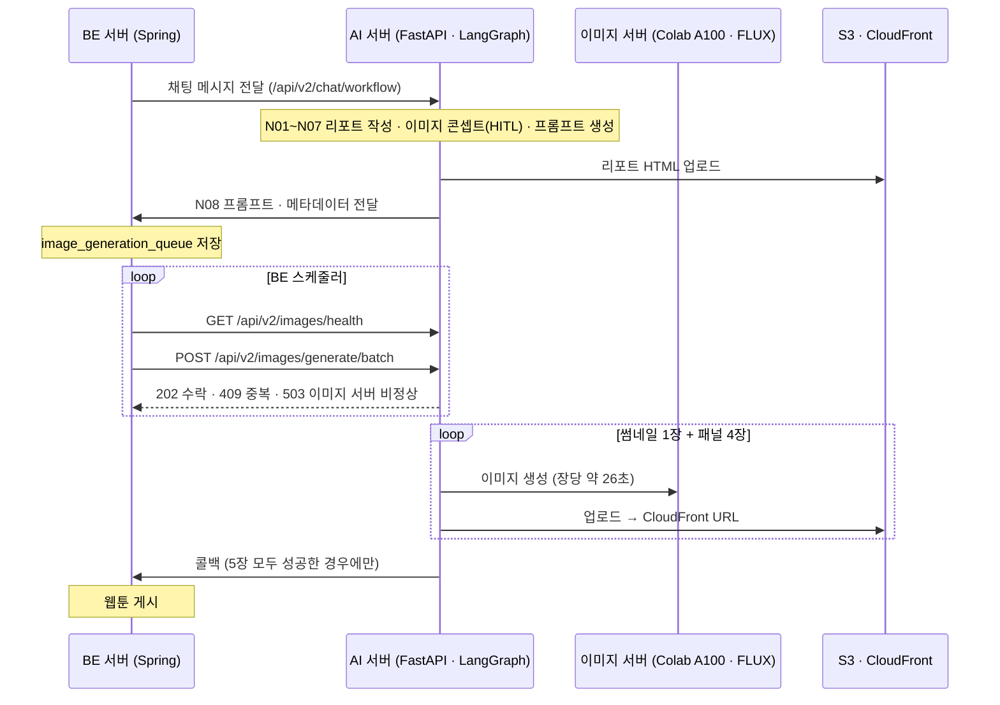

# NewSum AI

뉴스를 조사·요약한 리포트를 바탕으로 4컷 웹툰을 생성하는 서비스의 AI 서버입니다.
LangGraph 워크플로로 리포트와 이미지 프롬프트를 만들고, FLUX 이미지 서버로 웹툰 이미지를 생성해 BE 서버에 전달합니다.

| | |
|---|---|
| 기간 | 2025.04 – 2025.06 |
| 팀 | 7명 (풀스택 2 · AI 2 · Cloud 3) |
| 역할 | AI 이미지 파트 — 이미지 생성 API, 이미지 모델 서빙, LangGraph 이미지 노드, BE 연동 |
| 스택 | Python, FastAPI, LangGraph, PostgreSQL, AWS S3 · CloudFront, FLUX.1-dev, Colab |
| 관련 레포 | [AI (원본)](https://github.com/100-hours-a-week/17-newsum-ai) · [BE](https://github.com/100-hours-a-week/17-newsum-be) |

## 목차
- [서비스 흐름](#서비스-흐름)
- [담당 범위](#담당-범위)
- [트러블슈팅](#트러블슈팅)
- [이미지 모델 서빙](#이미지-모델-서빙)
- [LangGraph 워크플로](#langgraph-워크플로)
- [개선 이력](#개선-이력)
- [테스트](#테스트)
- [프로젝트 구조](#프로젝트-구조)

## 서비스 흐름



이미지 5장 생성에는 2분 이상 걸리기 때문에, 배치 요청은 `202 Accepted`로 먼저 응답하고 결과는 콜백으로 전달합니다.

## 담당 범위

- **이미지 생성 API** — 배치 생성 · 헬스체크 엔드포인트, 생성 결과 검증, S3 · CloudFront 업로드와 BE 콜백
  ([`image_endpoints.py`](app/api/v2/image_endpoints.py), [`image_background_tasks.py`](app/api/v2/image_background_tasks.py), [`image_service.py`](app/services/image_service.py), [`storage_service.py`](app/services/storage_service.py))
- **이미지 모델 서빙** — Colab A100에서 FLUX 모델을 FastAPI로 서빙하고 ngrok으로 외부에 연결
  ([`image_model_tunneling.ipynb`](image_model_tunneling.ipynb), [`flux_checkpoint_tunneling.ipynb`](flux_checkpoint_tunneling.ipynb))
- **LangGraph** — 워크플로 state 구조 설계, 리포트 합성 · 이미지 콘셉트 · 프롬프트 생성 · BE 전송 노드 (N04, N06~N08)
- **BE 연동** — 프롬프트 전달 · 이미지 생성 · 콜백 API 명세 협의

## 트러블슈팅

### 1. 이미지 일부가 실패해도 웹툰이 게시되는 문제

| | |
|---|---|
| 문제 | 이미지 5장 중 일부가 생성·업로드에 실패해도 남은 이미지만으로 웹툰이 게시될 수 있었습니다. |
| 원인 | 생성 결과를 개수 확인 없이 콜백으로 보냈고, BE 콜백 API도 빈 목록만 검사한 뒤 받은 링크 수만큼 웹툰을 저장했습니다. Colab 이미지 서버는 세션 종료 · 모델 로딩 중 요청 실패가 잦았습니다. |
| 해결 | 요청한 프롬프트 수와 업로드에 성공한 이미지 수가 다르면 콜백을 보내지 않도록 했습니다. 실패한 작업은 요청 ID 기록을 지워 BE가 다음 주기에 다시 요청할 수 있게 했습니다. |
| 결과 | 5장이 모두 준비된 경우에만 웹툰이 게시됩니다. |
| 근거 | [`0bb1a05`](https://github.com/100-hours-a-week/17-newsum-ai/commit/0bb1a05) ([#174](https://github.com/100-hours-a-week/17-newsum-ai/pull/174)), [`94b67e1`](https://github.com/100-hours-a-week/17-newsum-ai/commit/94b67e1) ([#183](https://github.com/100-hours-a-week/17-newsum-ai/pull/183)), BE [`WebtoonService`](https://github.com/100-hours-a-week/17-newsum-be/blob/dev/src/main/java/com/akatsuki/newsum/domain/webtoon/service/WebtoonService.java) |

### 2. 이미지 서버 상태가 늦게 반영되는 문제

| | |
|---|---|
| 문제 | 서버 로그에 헬스체크 실패가 반복되었고, BE가 확인하는 상태와 실제 이미지 서버 상태가 어긋났습니다. |
| 원인 | 백그라운드 루프가 정상 시 300초, 비정상 시 60초 간격으로 갱신한 값을 반환해 상태가 최대 5분 늦게 반영되었습니다. Colab은 재시작 시 모델 로드에 수 분이 걸리고, 세션이 끝나면 ngrok 터널이 닫혀 404를 반환합니다. |
| 해결 | 루프를 없애고 요청 시점에 이미지 서버를 확인하도록 바꿨습니다(timeout 30초 → 5초). 배치 요청에서도 비정상이면 `503`을 반환해, 503을 받으면 1분 뒤 재시도하는 BE 스케줄러 정책과 맞췄습니다. |
| 결과 | 이미지 서버 장애 시 작업을 시작하지 않고 즉시 503으로 거절합니다. 이전에는 배치 요청을 일단 202로 수락해, 백그라운드에서 실패하면 BE는 실패 여부를 알 수 없었습니다. |
| 근거 | [#177](https://github.com/100-hours-a-week/17-newsum-ai/pull/177) (문제 상황), [`eece617`](https://github.com/100-hours-a-week/17-newsum-ai/commit/eece617) ([#179](https://github.com/100-hours-a-week/17-newsum-ai/pull/179)), BE [`ImageQueueService`](https://github.com/100-hours-a-week/17-newsum-be/blob/dev/src/main/java/com/akatsuki/newsum/domain/webtoon/service/ImageQueueService.java) |

### 3. 같은 뉴스의 웹툰이 중복 생성되는 문제

| | |
|---|---|
| 문제 | 같은 뉴스의 웹툰이 중복 게시되었습니다. |
| 원인 | BE 스케줄러가 완료 시각이 비어 있는 작업을 매 주기 다시 요청했고, 여기에는 생성 중인 작업도 포함되었습니다. AI 서버는 같은 요청 ID로 이미지를 다시 생성했고, BE는 같은 작업의 콜백을 받을 때마다 웹툰을 저장했습니다. |
| 해결 | BE와 함께 분석해 역할을 나눴습니다. AI 서버는 요청 ID 추적 테이블로 같은 요청을 `409`로 거절하고, BE는 콜백 시 완료 여부를 확인하고 스케줄 주기를 5분에서 30분으로 늘렸습니다. |
| 개선 | 이후 요청 ID를 조회 → 헬스체크(최대 5초) → 등록하는 사이의 경쟁 구간을 `INSERT … ON CONFLICT DO NOTHING RETURNING` 한 번으로 판정하도록 바꿨습니다. |
| 결과 | 같은 요청 ID 동시 요청 10건 중 수락: **10건 → 1건** (실제 PostgreSQL 기반 테스트) |
| 근거 | [`94b67e1`](https://github.com/100-hours-a-week/17-newsum-ai/commit/94b67e1) · [`374ee45`](https://github.com/100-hours-a-week/17-newsum-ai/commit/374ee45) ([#183](https://github.com/100-hours-a-week/17-newsum-ai/pull/183)), BE [#231](https://github.com/100-hours-a-week/17-newsum-be/pull/231) · [#233](https://github.com/100-hours-a-week/17-newsum-be/pull/233), [PR #1](https://github.com/tldnr1/17-newsum-ai/pull/1) |

## 이미지 모델 서빙

인프라 예산(100만원) 안에서 LLM 서버, 서비스 서버와 함께 FLUX급 이미지 모델용 GPU를 따로 빌리기는 어려웠습니다.
그래서 Colab Pro+ A100(40GB)에서 FastAPI 서버를 띄우고 ngrok으로 외부에 연결해, 추가 GPU 비용 없이 이미지 서버를 운영했습니다.

| 항목 | 내용 |
|---|---|
| 모델 | FLUX.1-dev 기반, 요청의 `model_name`으로 스타일(LoRA · 체크포인트) 선택 |
| 모델 비교 | 장당 생성 시간 FLUX 44~45초, SDXL 18~19초 측정 ([#137](https://github.com/100-hours-a-week/17-newsum-ai/pull/137)) |
| 생성 시간 | 1024×1024 기준 장당 약 26초, 5장 순차 생성 |
| 연결 | ngrok 고정 도메인. 무료 플랜의 처리량 제한 때문에 도메인 2개를 번갈아 사용 |
| 가용성 | 세션 재시작 시 모델 로드에 수 분이 걸려, AI 서버가 요청 시점에 상태를 확인하고 503으로 거절 ([트러블슈팅 2](#2-이미지-서버-상태가-늦게-반영되는-문제)) |

## LangGraph 워크플로

노드마다 자기 state를 갖는 2단 구조로 설계해, 노드 간 상태 전이를 명확히 하고 LangSmith에서 추적하기 쉽게 했습니다 ([#134](https://github.com/100-hours-a-week/17-newsum-ai/pull/134)).
사용자는 채팅으로 단계별 결과에 피드백을 주고, 해당 노드부터 다시 실행할 수 있습니다(HITL).

| 노드 | 역할 | 담당 |
|---|---|:---:|
| N01 | 주제 구체화 | |
| N02 | 조사 계획 수립 | |
| N03 | 검색 실행 | |
| N04 | 리포트 작성 · 카테고리 · 키워드 | ● |
| N05 | 페르소나 의견 생성 | |
| N06 | 기승전결 4컷 이미지 콘셉트 · 피드백 반영 | ● |
| N07 | 영문 이미지 프롬프트 생성 | ● |
| N08 | 리포트 HTML 업로드 · BE로 프롬프트 전달 | ● |

코드: [`app/nodes_v3`](app/nodes_v3), [`app/workflows/main_workflow.py`](app/workflows/main_workflow.py), [`app/workflows/state_v3.py`](app/workflows/state_v3.py)

## 개선 이력

| 날짜 | 내용 | 링크 |
|---|---|---|
| 2025-05-22 | 워크플로 state를 노드별 2단 구조로 재설계, HITL 테스트 | [#134](https://github.com/100-hours-a-week/17-newsum-ai/pull/134) |
| 2025-05-27 | LLM 교체(Qwen3)에 맞춰 워크플로 노드 재작성, 작가별 이미지 스타일 매핑 | [#137](https://github.com/100-hours-a-week/17-newsum-ai/pull/137) |
| 2025-06-11 | CloudFront 업로드 구현 | [`d9112cc`](https://github.com/100-hours-a-week/17-newsum-ai/commit/d9112cc) |
| 2025-06-13 | 이미지 수 검증으로 부분 게시 차단, CloudFront URL로 콜백 | [#174](https://github.com/100-hours-a-week/17-newsum-ai/pull/174) |
| 2025-06-17 | 요청 시점 헬스체크 · 503 응답 | [#179](https://github.com/100-hours-a-week/17-newsum-ai/pull/179) |
| 2025-06-20 | 요청 ID 기반 중복 생성 방지 (BE와 분담) | [#183](https://github.com/100-hours-a-week/17-newsum-ai/pull/183) |
| 2026-09-29 | 요청 ID 등록을 원자적 INSERT로 변경, 동시성 테스트 추가 | [PR #1](https://github.com/tldnr1/17-newsum-ai/pull/1) |

## 테스트

배치 이미지 생성 API의 중복 방지를 실제 PostgreSQL(Testcontainers)로 검증합니다. 이미지 서버 · 스토리지 · BE 콜백은 가짜 객체로 대체합니다.

```bash
# Docker 실행 필요
pip install -r requirements.txt
pytest tests/image
```

| 테스트 | 검증 내용 |
|---|---|
| `test_concurrent_duplicate_requests_accept_only_one` | 같은 요청 ID 동시 10건 → 202 1건, 409 9건, 생성 작업 1회 |
| `test_unhealthy_server_returns_503_and_allows_retry` | 이미지 서버 비정상 시 503, 회복 후 같은 ID로 재요청 가능 |
| `test_failed_job_can_be_requested_again_after_cleanup` | 생성 실패로 기록이 지워진 작업은 다시 요청 가능 |

## 프로젝트 구조

```
app/
├── api/v2/
│   ├── endpoints.py               # 채팅 · 워크플로 API
│   ├── image_endpoints.py         # 이미지 배치 생성 · 헬스체크 API
│   └── image_background_tasks.py  # 이미지 생성 → 업로드 → 콜백
├── nodes_v3/                      # LangGraph 노드 (N01~N08)
├── workflows/                     # 워크플로 그래프 · state
├── services/                      # 이미지 · 스토리지 · DB · LLM · BE 클라이언트
└── workers/                       # 채팅 워커
tests/image/                       # 이미지 API 테스트
*_tunneling.ipynb                  # Colab 모델 서빙 노트북
docs/                              # 팀 README · 노드 설계 문서 (2025.05~06)
```

설치 · 환경 변수 · 워커 실행 등 전체 가이드는 [팀 README](docs/README_team_2025-05.md)를 참고해 주세요.
